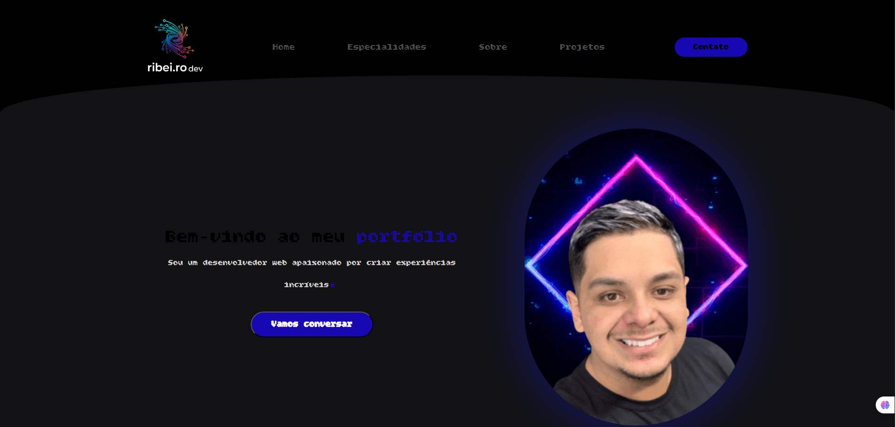

# 🌐 Portfólio - Gabriel Ribeiro

Bem-vindo ao meu portfólio!  
Este projeto foi desenvolvido para apresentar minhas habilidades, especialidades e projetos como **desenvolvedor web**.  

🔗 **Acesse online**: https://portifolio-two-opal.vercel.app/

---

## 🚀 Tecnologias Utilizadas
- **HTML5** - Estruturação de conteúdo
- **CSS3** - Estilização e responsividade
- **Bootstrap Icons** - Ícones
- **Google Fonts** - Tipografia personalizada

---

## 📌 Seções do Site
- **Home** → Apresentação
- **Especialidades** → Tecnologias que domino
- **Sobre** → Minha trajetória
- **Projetos** → Portfólio de trabalhos

---

## 📷 Preview


---

## ⚙️ Como rodar localmente
Clone o repositório:
```bash
git clone https://github.com/SEU-USUARIO/portfolio.git
